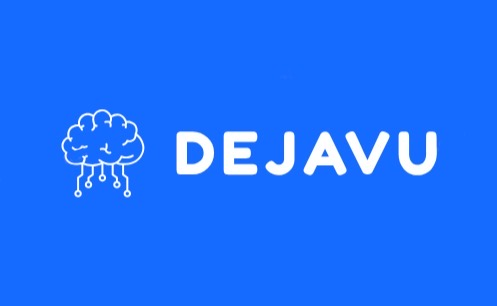

<<<<<<< HEAD
# DejaVu: Making Memories Unforgettable 
=======
#  DejaVu: Making Memories Unforgettable 
>>>>>>> 13e166b (Changed basic README headers)

> DejaVu is a platform that allows you to search through your memories and find those moments that you just can't remember...
>
> Submitted to Hack The North 2023!

<!-- PROJECT SHIELDS -->
![Contributors][contributors-shield]
![Commits][commits-shield]
![Code Size][code-size-shield]
![Forks][forks-shield]
![Stargazers][stars-shield]
![Issues][issues-shield]
![MIT License][license-shield]


<!-- PROJECT LOGO -->
<br />
<div align="center">
  <a href="https://github.com/iankorovinsky/hack-the-north-2023">
    
  </a>

  <p align="center">
    Say goodbye to déjà vu. 
    <br />
  </p>

</div>

<!-- ABOUT THE PROJECT -->
## About The Project

[![Product Name Screen Shot][product-screenshot]](https://example.com)

Have you ever been in a situation where you feel like you've been there before, but you just can't remember when? Introducing the extraordinary world of DejaVu, where your treasured memories are brought back to life with a touch of magic and innovation. We all know that feeling - the faint whisper of a forgotten memory, just out of grasp. But fear not, for DejaVu is here to help you relive those cherished moments from the depths of your video archives.

Our state-of-the-art software is your personal memory time machine, ready to embark on a journey through your life's recorded adventures. Simply enter a few descriptive phrases from the memory you're seeking, and watch as DejaVu tirelessly scours your video recordings. It meticulously pieces together the fragments of your past, creating a mesmerizing playback that captures the essence of that special moment.

Rediscover the joy, the laughter, and the heartfelt emotions that were once locked away in the depths of your mind. DejaVu doesn't just bring back memories; it rekindles the warmth and nostalgia that make your life story truly unique. So, why let those precious moments fade into obscurity when you can make them unforgettable with DejaVu? Join us in this remarkable journey of memory exploration and become the curator of your own cherished experiences. 

### Built With

Here are the major languages/technologies we used for creating our project:

* [![Next][Next.js]][Next-url]
* [![Python][Python]][Python-url]
* [![Google Cloud][Google-Cloud]][Google-Cloud-url]
* [![OpenCV][OpenCV]][OpenCV-url]
* [![OpenAI Whisper][OpenAI-Whisper]][OpenAI-Whisper-url]
* [![SciKit-Learn][SciKit-Learn]][SciKit-Learn-url]

And not to forget, here are some APIs and libraries that we were able to include in the process:

- [Cohere](https://cohere.com/)
- [PyAudio](https://pypi.org/project/PyAudio/)
- [Transformers](https://rpradeepmenon.medium.com/introduction-to-large-language-models-and-the-transformer-architecture-534408ed7e61)
- [Contrastive Language-Image Pretraining: CLIP](https://github.com/openai/CLIP)
- [MoviePy](https://pypi.org/project/moviepy/)

<!-- GETTING STARTED -->
## Installation (For Developers)

This is an example of how you may give instructions on setting up your project locally. To get a local copy up and running follow these simple example steps.

### Front-End

```shell
cd frontend
```

Install all dependencies, and next

```shell
npm i next
npm install -a
```

Run web app!

```shell
npm run dev
```

### Backend Setup and Deployment

Follow these steps to set up the backend environment and deploy your app. These instructions will guide you through creating a virtual environment and installing dependencies.

#### Step 1: Virtual Environment and Dependencies

1. Create a virtual environment and activate it:

   ```shell
   python -m venv venv
   source venv/bin/activate  # On Windows: venv\Scripts\activate
   ```

2. Install the required dependencies from `requirements.txt`:
   ```shell
   pip install -r requirements.txt
   ```

#### Step 2: Starting the Server Locally

Start the server using the following command:

```shell
python hardware/main.py
```

And there we go! Your camera should be up and running!

<!-- OUR STORY -->

## Our Story

### Inspiration Behind DejaVu

The inspiration behind DejaVu is deeply rooted in our fascination with the human experience and the power of memories. We've all had those moments where we felt a memory on the tip of our tongues but couldn't quite grasp it, like a fleeting dream slipping through our fingers. These fragments of the past hold immense value, as they connect us to our personal history, our emotions, and the people who have been a part of our journey. 🌟✨

We embarked on the journey to create DejaVu with the vision of bridging the gap between the past and the present, between what's remembered and what's forgotten. Our goal was to harness the magic of technology and innovation to make these elusive memories accessible once more. We wanted to give people the power to rediscover the treasures hidden within their own minds, to relive those special moments as if they were happening all over again, and to cherish the emotions they evoke. 🚀🔮

The spark that ignited DejaVu came from a profound understanding that our memories are not just records of the past; they are the essence of our identity. We wanted to empower individuals to be the architects of their own narratives, allowing them to revisit their life's most meaningful chapters. With DejaVu, we set out to create a tool that could turn the faint whispers of forgotten memories into vibrant, tangible experiences, filling our lives with the warmth of nostalgia and the joy of reconnection. 🧠🔑


### How We Built DejaVu 

It all starts with the hardware component. There is a video/audio-recording script running on a laptop, to which a webcam is connected. This webcam is connected to the user's hat, which they wear on their head and it records video. Once the video recording is stopped, the video is uploaded to a storage bucket on Google Cloud. 🎥☁️

The video is retrieved by the backend, which can then be processed. Vector embeddings are generated for both the audio and the video so that semantic search features can be integrated into our software. After that, the resulting vectors can be leveraged to deliver content to the front-end through a Flask microservice. 🖥️🚀

Our front-end, which was created using Next.js and hosted on Vercel, features a landing page and a search page. On the search page, a user can search a query for a memory which they are attempting to recall. After that, the query text is sent to the backend through a request, and the necessary information relating to the location of this memory is sent back to the frontend. After this occurs, the video where this memory occurs is displayed on the screen and allows the user to get rid of the ominous feeling of déjà vu. 🔎🌟


### Challenges We Overcame at DejaVu 

🧩 Overcoming Hardware Difficulties 🛠️

One of the significant challenges we encountered during the creation of DejaVu was finding the right hardware to support our project. Initially, we explored using AdHawk glasses, which unfortunately removed existing functionality critical to our project's success. Additionally, we found that the Raspberry Pi, while versatile, didn't possess the computing power required for our memory time machine. To overcome these hardware limitations, we had to pivot and develop Python scripts for our laptops, ensuring we had the necessary processing capacity to bring DejaVu to life. This adaptation proved to be a critical step in ensuring the project's success. 🚫💻

📱 Navigating the Complex World of Vector Embedding 🌐

Another formidable challenge we faced was in the realm of vector embedding. This intricate process, essential for capturing and understanding the essence of memories, presented difficulties throughout our development journey. We had to work diligently to fine-tune and optimize the vector embedding techniques to ensure the highest quality results. Overcoming this challenge required a deep understanding of the underlying technology and relentless dedication to refining the process. Ultimately, our commitment to tackling this complexity paid off, as it is a crucial component of DejaVu's effectiveness. 🔍📈

🌐 Connecting App Components and Cloud Hosting with Google Cloud 🔗

Integrating the various components of the DejaVu app and ensuring seamless cloud hosting were additional challenges we had to surmount. This involved intricate work to connect user interfaces, databases, and the cloud infrastructure with Google Cloud services. The complexity of this task required meticulous planning and execution to create a cohesive and robust platform. We overcame these challenges by leveraging the expertise of our team and dedicating considerable effort to ensure that all aspects of the app worked harmoniously, providing users with a smooth and reliable experience. 📱☁️


### Accomplishments We Celebrate at DejaVu 

🚀 Navigating the Hardware-Software Connection Challenge 🔌

One of the most significant hurdles we faced during the creation of DejaVu was connecting hardware and software seamlessly. The integration of our memory time machine with the physical devices and sensors posed complex challenges. It required a delicate balance of engineering and software development expertise to ensure that the hardware effectively communicated with our software platform. Overcoming this challenge was essential to make DejaVu a user-friendly and reliable tool for capturing and reliving memories, and our team's dedication paid off in achieving this intricate connection. 💻🤝

🕵️‍♂️ Mastering Semantic Search Complexity 🧠

Another formidable challenge we encountered was the implementation of semantic search. Enabling DejaVu to understand the context and meaning behind users' search queries proved to be a significant undertaking. Achieving this required advanced natural language processing and machine learning techniques. We had to develop intricate algorithms to decipher the nuances of human language, ensuring that DejaVu could provide relevant results even for complex or abstract queries. This challenge was a testament to our commitment to delivering a cutting-edge memory time machine that truly understands and serves its users. 📚🔍

🔗 Cloud Hosting and Cross-Component Integration 🌐

Integrating the various components of the DejaVu app and hosting data on Google Cloud presented a multifaceted challenge. Creating a seamless connection between user interfaces, databases, and cloud infrastructure demanded meticulous planning and execution. Ensuring that the app operated smoothly and efficiently, even as it scaled, required careful design and architecture. We dedicated considerable effort to overcome this challenge, leveraging the robust capabilities of Google Cloud to provide users with a reliable and responsive platform for preserving and reliving their cherished memories. 📱☁️


### Lessons Learned from DejaVu's Journey

💻 Innate Hardware Limitations 🚀

One of the most significant lessons we've gleaned from creating DejaVu is the importance of understanding hardware capabilities. We initially explored using Arduinos and Raspberry Pi's for certain aspects of our project, but we soon realized their innate limitations. These compact and versatile devices have their place in many projects, but for a memory-intensive and complex application like DejaVu, they proved to be improbable choices. 🤖🔌

📝 Planning Before Executing 🤯

A crucial takeaway from our journey of creating DejaVu was the significance of meticulous planning for user flow before diving into coding. There were instances where we rushed into development without a comprehensive understanding of how users would interact with our platform. This led to poor systems design, resulting in unnecessary complications and setbacks. We learned that a well-thought-out user flow and system architecture are fundamental to the success of any project, helping to streamline development and enhance user experience. 🚀🌟

🤖 Less Technology is More Progress💡

Another valuable lesson revolved around the concept that complex systems can often be simplified by reducing the number of technologies in use. At one point, we experimented with a CockroachDB serverless database, hoping to achieve certain functionalities. However, we soon realized that this introduced unnecessary complexity and redundancy into our architecture. Simplifying our technology stack and focusing on essential components allowed us to improve efficiency and maintain a more straightforward and robust system. 🗃️🧩


### The Future of DejaVu: Where Innovation Thrives! 

🧩 Facial Recognition and Video Sorting 📸

With our eyes set on the future, DejaVu is poised to bring even more remarkable features to life. This feature will play a pivotal role in enhancing the user experience. Our ongoing development efforts will allow DejaVu to recognize individuals in your video archives, making it easier than ever to locate and relive moments featuring specific people. This breakthrough in technology will enable users to effortlessly organize their memories, unlocking a new level of convenience and personalization. 🤳📽️

🎁 Sharing Memories In-App 📲

Imagine being able to send a cherished memory video from one user to another, all within the DejaVu platform. Whether it's a heartfelt message, a funny moment, or a shared experience, this feature will foster deeper connections between users, making it easy to celebrate and relive memories together, regardless of physical distance. DejaVu aims to be more than just a memory tool; it's a platform for creating and sharing meaningful experiences. 💌👥

💻 Integrating BCI (Brain-Computer Interface) Technology 🧠

This exciting frontier will open up possibilities for users to interact with their memories in entirely new ways. Imagine being able to navigate and interact with your memory archives using only your thoughts. This integration could revolutionize the way we access and relive memories, making it a truly immersive and personal experience. The future of DejaVu is all about pushing boundaries and providing users with innovative tools to make their memories more accessible and meaningful. 🌐🤯


<!-- LICENSE -->
## License

Distributed under the MIT License. See `LICENSE.txt` for more information.

<!-- CONTACT -->
## Contact

If you would like to find out more information about our project, feel free to reach out to us on LinkedIn:

- Rajan Agarwal - [LinkedIn](https://www.linkedin.com/in/rajansagarwal/) - r34agarw@uwaterloo.ca
- Ian Korovinsky - [LinkedIn](https://www.linkedin.com/in/ian-korovinsky/) - ikorovin@uwaterloo.ca
- Nicole Pardal - [LinkedIn](https://www.linkedin.com/in/nicolepardal/) - npardal@uwaterloo.ca
- Nima Pourjafar - [LinkedIn](https://www.linkedin.com/in/nima-pourjafar/) - npourjaf@uwaterloo.ca

Or, to see our submission to [Hack The North 2023](https://hackthenorth2023.devpost.com/?ref_content=default&ref_feature=challenge&ref_medium=portfolio), feel free to check out our [Devpost](https://devpost.com/software/DejaVu)!

<!-- MARKDOWN LINKS & IMAGES -->
<!-- https://www.markdownguide.org/basic-syntax/#reference-style-links -->
[contributors-shield]: https://img.shields.io/github/contributors/iankorovinsky/hack-the-north-2023.svg?style=for-the-badge
[contributors-url]: https://github.com/iankorovinsky/hack-the-north-2023/graphs/contributors
[forks-shield]: https://img.shields.io/github/forks/iankorovinsky/hack-the-north-2023.svg?style=for-the-badge
[forks-url]: https://github.com/iankorovinsky/hack-the-north-2023/network/members
[stars-shield]: https://img.shields.io/github/stars/iankorovinsky/hack-the-north-2023.svg?style=for-the-badge
[stars-url]: https://github.com/iankorovinsky/hack-the-north-2023/stargazers
[issues-shield]: https://img.shields.io/github/issues/iankorovinsky/hack-the-north-2023.svg?style=for-the-badge
[issues-url]: https://github.com/iankorovinsky/hack-the-north-2023/issues
[license-shield]: https://img.shields.io/github/license/othneildrew/Best-README-Template.svg?style=for-the-badge
[license-url]: https://opensource.org/license/mit/
[commits-shield]:https://img.shields.io/github/commit-activity/t/iankorovinsky/hack-the-north-2023.svg?style=for-the-badge
[commits-url]:https://github.com/iankorovinsky/hack-the-north-2023/commits
[pull-requests-shield]:https://img.shields.io/github/issues-pr/iankorovinsky/hack-the-north-2023.svg?style=for-the-badge
[pull-requests-url]:https://github.com/iankorovinsky/hack-the-north-2023/pulls
[code-size-shield]:https://img.shields.io/github/languages/code-size/iankorovinsky/hack-the-north-2023.svg?style=for-the-badge
[tests-passing-shield]: https://img.shields.io/github/actions/workflow/status/:user/hack-the-north-2023.svg?style=for-the-badge
[product-screenshot]: images/screenshot.png
[Next.js]: https://img.shields.io/badge/next.js-808080?style=for-the-badge&logo=nextdotjs&logoColor=white
[Next-url]: https://nextjs.org/
[Python]: https://img.shields.io/badge/python-FF0000?style=for-the-badge&logo=python&logoColor=white
[Python-url]:https://www.python.org/
[Google-Cloud]:https://img.shields.io/badge/google_cloud-008000?style=for-the-badge&logo=googlecloud&logoColor=white
[Google-Cloud-url]:https://cloud.google.com/
[OpenCV]:https://img.shields.io/badge/opencv-0000FF?style=for-the-badge&logo=opencv&logoColor=white
[OpenCV-url]:https://opencv.org/
[OpenAI-Whisper]:https://img.shields.io/badge/openai_whisper-000000?style=for-the-badge&logo=openai&logoColor=white
[OpenAI-Whisper-url]:https://openai.com/research/whisper
[SciKit-Learn]:https://img.shields.io/badge/scikit_learn-FFC0CB?style=for-the-badge&logo=scikitlearn&logoColor=black
[SciKit-Learn-url]:https://scikit-learn.org/
